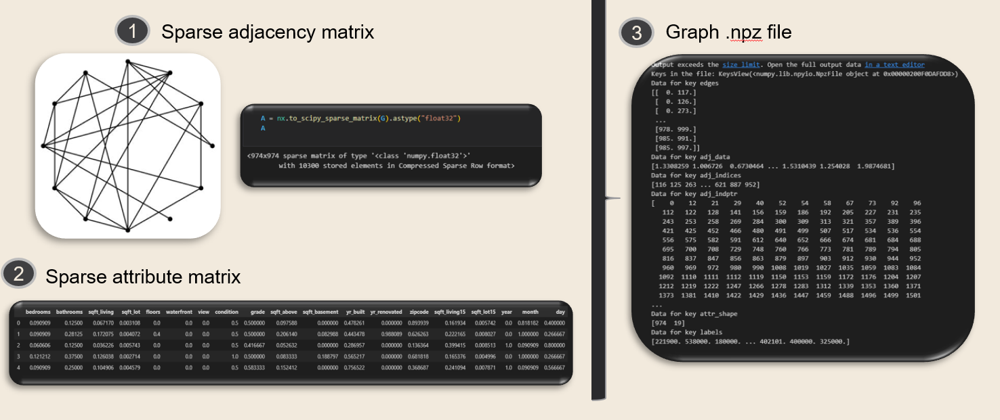

# Network Embeddings for House Price Predictions

### Requirements
``
Python version 3.6.13

Networkx version 2.5.1

Scikit-learn 0.24.2

Tensorflow 1.15.0

Scipy 1.5.4 
``

1) "DataPipeline.ipynb" represents the data pipeline of transforming tabular data to graph files. The current pipeline is compatible with GLACE and GSNE, minor adjustments are necessary based on the used datasets. The notebook used the open-source datasets of King county: "kc_school_data.csv" and "kc_house_data.csv". The data itself only has as requirement that it contains variables regarding its location coordinates. 

2) After generating the graph .npz files by executing the "DataPipeline.ipynb" notebook, a network embedding model must be executed. The GLACE folder contains all the necessary components to seamlessly run the model after the execution of the aforementioned notebook. For the data used in this repository the folder of GSNE_adjusted should be utilized, since that code is adjusted to be compatible for using two points of interest.

3) Ultimately, the "Modelling_embedding.ipynb" notebook should be executed to conduct a benchmark analysis of the performance of the machine learning models on the generated Gaussian network embedding. 

