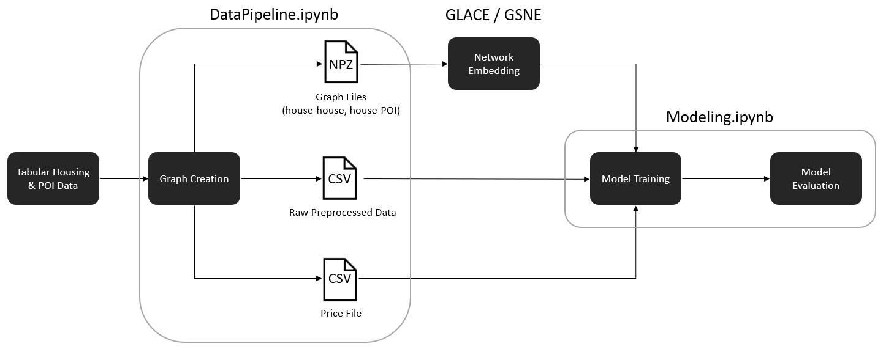
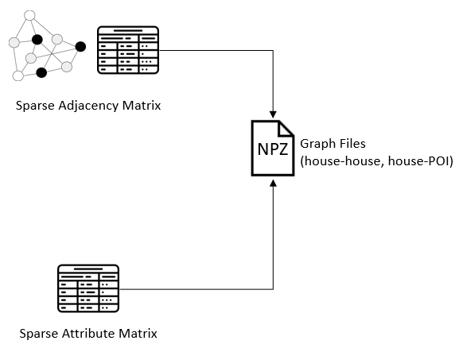

# Predicting house prices using geospatial network embeddings incorporating POIs
This Github repository outlines our conducted research on improving the predictive performance of house price predictions by utilizing Gaussian network embeddings. The repository contains code ranging from data preparation to model evaluation. The [GSNE](https://arxiv.org/pdf/2009.00254.pdf) and [GLACE](https://arxiv.org/pdf/2009.00254.pdf)
models were utilized to create the Gaussian network embeddings. Some adjustments have been made to these models to make them compatible with the King County datasets. We have also separated the data preprocessing pipeline and the house price prediction models into distinct Jupyter notebooks. This choice was made to facilitate future researchers in a user-friendly way to make adjustments to the different processes. 

# Requirements
The code required the following software and libraries:
```
Python 3.6.13

Networkx 2.5.1

Scikit-learn 0.24.2

Tensorflow 1.15.0

Scipy 1.5.4

Matplotlib 3.1.3

NumPy 1.21.5

Pandas 1.3.5
```

# Process of using network embeddings for house price predictions 



### **1. Data Preprocessing Pipeline** 
The Jupyter notebook "DataToGraph.ipynb" represents the data pipeline of transforming tabular data into graph files. The current pipeline is compatible with GLACE and GSNE_adjusted models. The notebook utilizes open-source datasets of King county: "kc_school_data.csv" and "kc_house_data.csv", respresenting respectively data on schools and houses in King County. The only requirement for the input data is that it must contain geographical coordinates (latitude and longitude) for the house or point of interest (POI). The notebook outputs the npz graph files in the GLACE and GSNE_adjusted folder. The graph files represent the actual graphs, which is encompassed by a sparse adjacency and sparse attribute matrix. This way all the connections of the graph are saved with the features of the nodes. This is done for graphs of house-house, house-school, and the combination of the aforementionned two connections. Aditionally, a dataframe is saved of the raw preprocessed data which is used for the conducted benchmark analysis in "Modelling.ipynb". The price file is also stored separately of the house data which is utilized as a target variable for model training and evaluation.

<p align="center">
  
</p>

### **2. Create Gaussian Network Embedding** 
After generating the graph npz files by executing the "DataToGraph.ipynb" notebook, a network embedding model can be executed. The GLACE folder contains all the necessary components to seamlessly run the network embedding model, after the creation of the necessary graph files. The GSNE folder contains the original code developed by its researchers. The GSNE_adjusted folder contains the GSNE code with some adjustments made for compatibility with one POI. Also some additional adjustments were made to make the code generalizable for other datasets and made sure that the code was actually executable. However, it should be noted that the current version suffers from an inconsistency regarding the Tensor shapes which causes an error for heterogeneous graph files, such as the house-school graph. This warrants further research in performing the right adjustments to the data pipeline or GSNE algorithm.

### **3. House Price Prediction Models** 
The "Modelling.ipynb" notebook contains the code for model training and evaluation. It conducts a benchmark analysis on the performance of house price prediction models with and without Gaussian embedding features under different conditions. The benchmark analysis is conducted for Linear Regression, XGBoost Regressor, and Random Forest Regressor. For the evaluation we utilized the metrics RMSE, MAE and MAPE to make several comparisons. 


